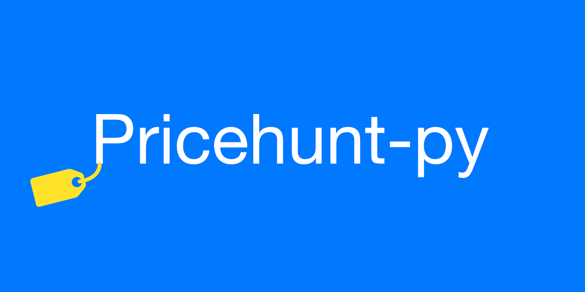
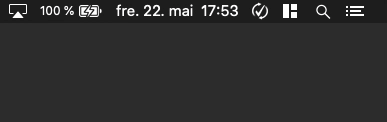

💰 Checking the difference between prices for different products on [Prisguiden.no](https://prisguiden.no).


## How to
Run the `main.py` script and select from the menu.
```
************MAIN MENU**************
Please enter a number
1: Add new product(s) to the list
2: Remove product(s) from the list
3: See details from the list
4: Run checker
5: Quit
```

## Run in background
Use cron jobs, see [crontab.guru](https://crontab.guru/) to figure out the schedule expression for the checking interval, I recommend not more
 often than 30 minutes (this would be `*/30 * * * *`). If you have never used cron before, check out the [crontab
  command help](https://www.computerhope.com/unix/ucrontab.htm).
  
```shell script
*/30 * * * * /LOCATION/OF/PYTHON/python3 /LOCATION/OF/SCRIPT/pricehunt-py/checker.py
```
  
On Windows, cron` is not installed by default. Use the [Windows Task Scheduler](https://en.wikipedia.org/wiki/Windows_Task_Scheduler) instead, or see this [StackOverflow
 question](https://stackoverflow.com/questions/132971/what-is-the-windows-version-of-cron) for alternatives.
 


## Features
- Add product(s) as a object (via `JSON` syntax).
- Check lowest price on specified product with correct URL.
- Iterate through `JSON`-file to check on multiple products.
- Unit tests for the different functions
- Add product(s) to the `JSON`-file through the main menu
- Remove product(s) to the `JSON`-file through the main menu
- Display the products in the `JSON`-file through the main menu
- See if you are eligible to use the *open policy* offered by some Norwegian stores.